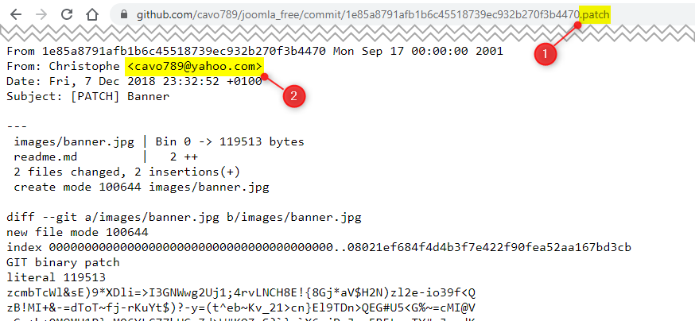

# Retrieve the email of a Github user

## The repo owner's email address

Let's say you want to retrieve the email of the `Nestor789` email.

Just go to the following URL `https://api.github.com/users/Nestor789/events/public` and search for the `email` keyword.

So, simply replace `Nestor789` in the URL above by the name of the user for whom you wish to retrieve the information.

## The email of the person who has made that specific commit

There is a second way to retrieve email, this time, the email that is linked to a given patch. It's explained [here](https://dev.to/codewithfahad/github-tip-of-the-day-keep-your-commit-email-address-private-2eo2).

Open any Github repository, open any commit and add `.path` as suffix in the URL; tadaaaa!

