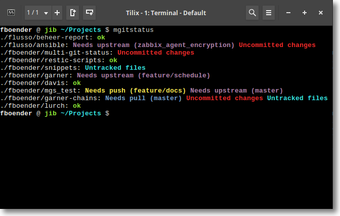

# Check status of repositories

> Check if repositories have been changed or needs to be refreshed

See [https://github.com/fboender/multi-git-status](https://github.com/fboender/multi-git-status). This tool will scan all repos in a parent folder and will show which ones have uncommitted changes, untracked files, needs push, needs pull, ...  That tool is really fast and give clear information's.

The easy way to use it is, f.i., to create a directory like `~/tools/` on your disk and make a git clone of the project in it. Then, in your `.bashrc` file (or ~/.zshrc`), just create an alias.


```bash
mkdir -p ~/tools
cd ~/tools
git clone git@github.com:fboender/multi-git-status.git
echo -e "\nalias mgitstatus='~/tools/multi-git-status/mgitstatus'" >> ~/.bashrc
```

Now, just fire f.i. `mgitstatus -e` in any folder having repositories. 


