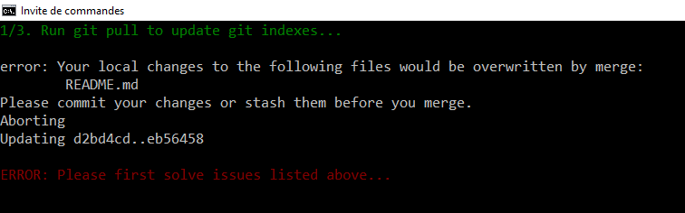
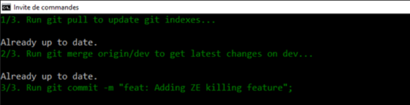

# Pull and merge before pushing

When there're several developers working on the same repository, *on the same branch or not*, you may be faced with the following problem: you're about to push your changes but someone already push his owns it before you.

So, at the time you're pushing, your local repository is no more synchronized with the latests changes on the remote repository.

**This can lead to a pipeline that is broken or to conflicts.**

So, in an ideal world, before pushing, it's advice to fist get the latests changes (`git pull`) in your branch, and, if you're working on a branch that is not your `dev` or `master` branch, to merge first with that branch.

1. `git pull` will get the latest changes on your current branch (let's say `myFeature`) so before pushing, you're sure to have the latest state of that branch,
2. `git merge origin/dev` will get the latest changes on the `dev` branch and merge them with your local (`myFeature`) branch so, here too, you're sure to not have conflicts before pushing your changes.

So, in a few words, don't run `git push` but `git pull && git merge origin/dev && git push` instead.

To make life easier, a git alias can be defined for that purpose.

You can define an alias per repo (edit the `.git/config` file for this) or globally (edit the `%USERPROFILE%\.gitconfig` file for this).

Add the following source in the `[alias]` section:

```text
    commerge = "!f() { \
        clear; \
        \
        if [ \"$#\" -ne 1 ]; then \
            echo \"Please mention the commit message\"; \
            echo For instance: git commerge \\\"feat: Adding new killing feature\\\"; \
            exit -1; \
        fi; \
        \
           printf \"\\\\033[0;32m1/3. Run git pull to synchronize our local copy...\\\\033[0m \\n\\n\"; \
        git pull; \
        \
        if [ $? -ne 0 ]; then \
            printf \"\\n\\\\033[0;31mERROR: Please first solve issues listed above...\\\\033[0m \\n\\n\"; \
            exit -1; \
        fi; \
        \
        printf \"\\\\033[0;32m2/3. Run git merge origin/dev to get latest changes on dev...\\\\033[0m \\n\\n\"; \
        git merge origin/master; \
        \
        if [ $? -ne 0 ]; then \
            printf \"\\n\\\\033[0;31mERROR: Please merge issues listed above...\\\\033[0m \\n\\n\"; \
            exit -1; \
        fi; \
        \
        commitMsg=\"$@\"; \
        printf \"\\\\033[0;32m3/3. Run git commit -m \\\""$commitMsg\\\"";\\\\033[0m \\n\\n\"; \
        git commit -m \"$commitMsg\"; \
        \
        if [ $? -ne 0 ]; then \
            printf \"\\n\\\\033[0;31mERROR: Commit error...\\\\033[0m \\n\\n\"; \
            exit -1; \
        fi; \
    }; f""
```

This will define the `commerge` alias as a function. First the console will be cleared (`clear;`), then the function will check the number of parameters (`if [ \"$#\" -ne 1 ];`). The alias require one parameter, the commit message.

The first action will be a `git pull` in your current branch and if there is a problem (`if [ $? -ne 0 ];`), an error message will be displayed like below:



If everything was fine, a `git merge origin/master` command is fired. Here too, if there is something wrong, the script will show an error message and stop.

The last and third part is to commit the changes (`git commit -m "$commitMsg"`).

The final action would be to run a manual `git push`.

So, in conclusion:

1. `git add .`,
2. `git commerge "feat: a new amazing feature"`,
3. `git push`


