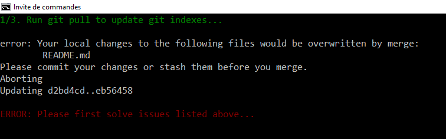
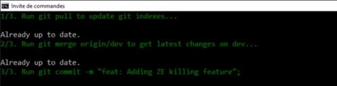

<!-- This file has been generated by the concat.sh script. -->
<!-- Don't modify this file manually (you'll loose your changes) -->
<!-- but run the tool once more -->
<!-- Last refresh date: Wednesday, December 28, 2022, 13:07:16 -->

# Git core, tips, tools and snippets


<!-- table-of-contents - start -->
* [Tips](#tips)
  * [Add a SSH key](#add-a-ssh-key)
  * [.gitattributes](#gitattributes)
  * [Git config](#git-config)
  * [Git init](#git-init)
  * [Git hooks folder](#git-hooks-folder)
  * [Enable verbose mode](#enable-verbose-mode)
  * [Get the list of modified files](#get-the-list-of-modified-files)
    * [Don't show deleted files](#don-t-show-deleted-files)
    * [Restrict based on the extension](#restrict-based-on-the-extension)
    * [Skip a folder](#skip-a-folder)
  * [Retrieve the email of a Github user](#retrieve-the-email-of-a-github-user)
    * [The repo owner's email address](#the-repo-owner-s-email-address)
    * [The email of the person who has made that specific commit](#the-email-of-the-person-who-has-made-that-specific-commit)
  * [Search users on github based on location](#search-users-on-github-based-on-location)
* [Git cheatsheet](#git-cheatsheet)
  * [Clone a specific branch files:](#clone-a-specific-branch-files) 
  * [Rename a local branch and push then](#rename-a-local-branch-and-push-then)
* [Core functions](#core-functions)
  * [Update a branch (merge request)](#update-a-branch-merge-request)
  * [Self update](#self-update)
* [Tools](#tools)
  * [Check status of repositories](#check-status-of-repositories)
  * [Deploy online](#deploy-online)
  * [Easy access to your stars](#easy-access-to-your-stars)
  * [Display the origin of repos](#display-the-origin-of-repos)
  * [Git pull](#git-pull)
  * [Get history of changes, cross repos](#get-history-of-changes-cross-repos)
* [Aliases](#aliases)
  * [Pull and merge before pushing](#pull-and-merge-before-pushing)
* [License](#license)<!-- table-of-contents - end -->

## Tips

### Add a SSH key

> [https://www.theserverside.com/blog/Coffee-Talk-Java-News-Stories-and-Opinions/GitHub-SSH-Key-Setup-Config-Ubuntu-Linux](https://www.theserverside.com/blog/Coffee-Talk-Java-News-Stories-and-Opinions/GitHub-SSH-Key-Setup-Config-Ubuntu-Linux)

Stop to clone repositories using `https` and prefer the `git` protocol. 

Before being able to do this, you'll need to add a SSH key and here is how to proceed:

* Start a Linux console and jump to the `.ssh` folder: `cd ~/.ssh`,
* Now, create a key for your GitHub profile (identified by your email address): `ssh-keygen -o -t rsa -C "YOUR_EMAIL`,
* Press enter for each questions i.e. keep default values,
* When done, display the content of your key by running `cat id_rsa.pub` and keep that info on the screen temporarily. You'll need that info very soon.
* Surf to `https://github.com/settings/profile` and click on the `SSH and GPG keys` in the left sidebar,
* Click on the `New SSH key` button and give a title to your new key,
* Copy/paste your key in the `Key` field and, finally,
* Click on the `Add SSH key`.

From now, you'll be able to use `git clone` and the `git@` protocol.

### .gitattributes

> [https://git-scm.com/docs/gitattributes](https://git-scm.com/docs/gitattributes)

The `.gitattributes` file will help to keep the same rules for your repository like making sure that all `.js` file are saved with `LF` and not `CRLF`.

It's like the `.editorconfig` file but for your repo: make sure everyone who'll push files to your repository (even you) will respect the rules specified in the `.gitattributes` file.

```sql
* text=auto

.*      text eol=lf
*.bat   text eol=crlf
*.cmd   text eol=crlf
*.css   text eol=lf
*.html  text eol=lf
*.js    text eol=lf
*.json  text eol=lf
*.jsx   text eol=lf
*.md    text eol=lf
*.php   text eol=lf
*.ps1   text eol=crlf
*.sh    text eol=lf
*.sql   text eol=lf
*.txt   text eol=lf
*.wsdl   text eol=lf
*.xml   text eol=lf
```

If you're creating a fresh repository, create your `.gitattributes.txt` file and add your rules; it'll be enough.

When the file is added on an existing repository, you'll need to refresh the cache; see [Be a Git ninja: the .gitattributes file]([🙏 Please Add .gitattributes To Your Git Repository](https://dev.to/deadlybyte/please-add-gitattributes-to-your-git-repository-1jld) for more.

### Git config

To view all your global parameters, the command below allows you to display them in the editor of your choice:

```bash
git config --global --edit
```

### Git init

When creating a new repo with `git init`, a template is used. The current version is located on `C:\Program Files\Git\mingw64\share\git-core\templates`.

By updating there f.i. the `pre-commit` script, you'll thus automatically get your customized version each time you create a new repo on your disk.

On Linux, the path is `/usr/share/git-core/templates`.

Note: you can change this settings by setting [`init.templateDir`](https://git-scm.com/docs/git-config#Documentation/git-config.txt-inittemplateDir) to your own template folder.

### Git hooks folder

By default, the `hooks` folder is located in the `.git` folder but this can be changed with the [core.hooksPath](https://git-scm.com/docs/git-config#Documentation/git-config.txt-corehooksPath) setting.

The following command will set the hooks folder for ALL PROJECTS to the `c:\repos\central_hooks` folder. This way, in only one instruction, you'll use the same set of hooks for all your repositories.

```bash
git config --global core.hooksPath c:/repos/central_hooks
```

Then inside of `c:\repos\central_hooks` you'll need to add a `/hooks` sub-folder and moved all of your own hooks there.

Note: you can also change hooks repos by repos using the command below:

```bash
git config core.hooksPath c:/repos/central_hooks
```

### Enable verbose mode

When running GIT commands like a `git commit`, we don't get so much output.

An example is when we're using hooks: if a `pre-commit` hooks is enabled, the hook will be fired by GIT but ... where is stored that hook? It's not really easy to know since it can be in the `.git/hooks` folder or elsewhere (depends on the core.hooksPath, local or global setting).

So, sometimes, it's useful to get more information. To do this, just create a new DOS environment variable called `GIT_TRACE` and initialize it to `1`.

The next time you'll run a GIT command, more information's will be echoed on the console.

Below, we can see it: we've a "Here I am!" when committing changes from the `git_tips` repo. Why? We can see it in the trace... There is a `hooks/pre-commit` script in the loop.

```log
C:\Christophe\Repository\git_tips>git commit -m "Add GIT_TRACE tip"
09:10:04.825250 exec-cmd.c:237          trace: resolved executable dir: C:/Program Files/Git/mingw64/bin
09:10:04.830257 git.c:439               trace: built-in: git commit -m 'Add GIT_TRACE tip'
09:10:04.859250 run-command.c:663       trace: run_command: GIT_EDITOR=: GIT_INDEX_FILE=.git/index 'c:/christophe/repository/resources/git_hooks/hooks/pre-commit'
Here I am!
```

### Get the list of modified files

Get a list of modified files not yet staged:

```bash
git status -s -uall
```

By using `-uall` we ask to list of files and not f.i. just a folder name when you've created a new one and put files in it. We wish all filenames so `-uall` will display it.

The result will be something like this:

```bash
 M composer.json
 M composer.lock
 M resources/template.html
 D src/Classes/Bulma.php
 D src/Classes/Datatables.php
 M src/Classes/MonologParser.php
 M src/Classes/ViewLogs.php
?? src/Helpers/Bulma.php
?? src/Helpers/Datatables.php
?? src/Helpers/Download.php
?? src/Helpers/Strings.php
?? src/Helpers/Xml.php
```

#### Don't show deleted files

If you don't want deleted files to be mentioned, under DOS, you can use the `findstr` pipe like this:

```bash
git status -s -uall| findstr /C:" D " /B /v
```

`/C:` is for search for a litteral value (not a regex but well a string) so `/C:" D "` will target all lines having, exactly, `D` (space D space) in his content
`/B` is for restricting the search to the start of the string (like  `^` in a regex expression)
`/v` is for excluding that selection.

So `/C:" D " /B` will match these lines from the above example:

```bash
 D src/Classes/Bulma.php
 D src/Classes/Datatables.php
```

And because we've used the `/v` parameter, we will exclude the selection so `git status -s -uall| findstr /C:" D " /B /v` will return this:

```bash
 M composer.json
 M composer.lock
 M resources/template.html
 D src/Classes/Bulma.php
 D src/Classes/Datatables.php
 M src/Classes/MonologParser.php
 M src/Classes/ViewLogs.php
?? src/Helpers/Bulma.php
?? src/Helpers/Datatables.php
?? src/Helpers/Download.php
?? src/Helpers/Strings.php
?? src/Helpers/Xml.php
```

#### Restrict based on the extension

Based on the example here above, `git status -s -uall| findstr /C:"html"` will match any files having the `.html` extension.

```bash
 M resources/template.html
```

#### Skip a folder

Still based on the example here above, `git status -s -uall| findstr /C:"/Helpers/" /v` will thus match any files in the `/Helpers/` folder (and subfolder) and invert the selection so, we'll skip any files in that folder.

```bash
 M composer.lock
 M resources/template.html
 D src/Classes/Bulma.php
 D src/Classes/Datatables.php
 M src/Classes/MonologParser.php
 M src/Classes/ViewLogs.php
```

### Retrieve the email of a Github user

#### The repo owner's email address

Let's say you want to retrieve the email of the `Nestor789` email.

Just go to the following URL `https://api.github.com/users/Nestor789/events/public` and search for the `email` keyword.

So, simply replace `Nestor789` in the URL above by the name of the user for whom you wish to retrieve the information.

#### The email of the person who has made that specific commit

There is a second way to retrieve email, this time, the email that is linked to a given patch. It's explained [here](https://dev.to/codewithfahad/github-tip-of-the-day-keep-your-commit-email-address-private-2eo2).

Open any Github repository, open any commit and add `.path` as suffix in the URL; tadaaaa!


### Search users on github based on location

The URL `https://github.com/search?q=+location:Racour&type=Users` will display the list of users for the city of `Racour` so just replace the city name to the one of your choice.

## Git cheatsheet

### Clone a specific branch files: 

`git clone --branch <branch-name> <url-repo>`

### Rename a local branch and push then

* `<oldname>` is the current name of the branch, the one you wish rename and
* `<newname>` the new name to give

1. `git branch <oldname>`
2. `git branch -m <newname>`
3. `git branch` <-- you should see the new name
4. `git push origin :<oldname>`
5. `git push origin <newname>:refs/heads/<oldname>`
6. `git push origin HEAD:<newname>` <-- now the branch is also online

## Core functions

### Update a branch (merge request)

You've a `dev` and a `myFeature` branches and you want to update the `myFeature` branch with the latest changes done in branch `dev`.

In a DOS Prompt Session, make sure you're in branch `myFeature` (run `git branch` or `git status` to confirm this).

Then, run these commands:

* `git pull` to make sure that your current branch is up-to-date (don't trust `git status`, it's always a good idea to run `git pull` even if `git status` has said *up-to-date*),
* `git merge origin/dev` so changes in `dev` branch are merge in the current (`myFeature`) branch,
* You'll probably have a lot of conflicts, 
   * `git status` so you can see the list of **Unmerged paths** (= conflict)
   * Now, you need to solve them; for instance,
      * Start vscode,
      * Show the `Source Control` pane (<kbd>CTRL</kbd>-<kbd>SHIFT</kbd>-<kbd>G</kbd> followed by <kbd>G</kbd> once more),
      * Select the list of files with conflicts and solve them one by one or all at once: right click on the file and accept all incoming changes.
      * This done, select the list of files once more, right click and commit changes.

### Self update

Run `git update-git-for-windows` to start the self-update of Git.

## Tools

### Check status of repositories

> Check if repositories have been changed or needs to be refreshed

See [https://github.com/fboender/multi-git-status](https://github.com/fboender/multi-git-status). This tool will scan all repos in a parent folder and will show which ones have uncommitted changes, untracked files, needs push, needs pull, ...  That tool is really fast and give clear information's.

The easy way to use it is, f.i., to create a directory like `~/tools/` on your disk and make a git clone of the project in it. Then, in your `.bashrc` file (or ~/.zshrc`), just create an alias.


```bash
mkdir -p ~/tools
cd ~/tools
git clone git@github.com:fboender/multi-git-status.git
echo -e "\nalias mgitstatus='~/tools/multi-git-status/mgitstatus'" >> ~/.bashrc
```

Now, just fire f.i. `mgitstatus -e` in any folder having repositories. 


### Deploy online

Get the newer version of a repository and update a website by just running /deploy.php?sat=MyVeryLongKey from an URL.

[https://github.com/cavo789/tools_git_scripts/tree/master/deploy](https://github.com/cavo789/tools_git_scripts/tree/master/deploy)

### Easy access to your stars

[Astral](https://astralapp.com/) is a free interface that displays the list of repositories you've starred.

The interface is easy to use and has a nice search tool so it becomes really simple to retrieve a liked repo.

### Display the origin of repos

> Display the origin of repositories

Scan all repositories on your hard disk under a root folder like `C:\Christophe\Repositories` and display the origin of each repos so you can easily see which are stored on github or elsewhere like gitlab or bitbucket.

[https://github.com/cavo789/tools_git_scripts/blob/master/update_repos/git_get_origin.bat](https://github.com/cavo789/tools_git_scripts/blob/master/update_repos/git_get_origin.bat)

### Git pull

> Check if local copy of repositories needs to be refreshed. This can be done only when no local changes have been made.

Scan all repositories on your hard disk under a root folder like `C:\Christophe\Repositories` and check the status of each repository. If a newer version is available online and if your local copy is unchanged, the repo will be updated automatically (a `git pull` will be made on the repo).

[https://github.com/cavo789/tools_git_scripts/blob/master/update_repos/git_pull.bat](https://github.com/cavo789/tools_git_scripts/blob/master/update_repos/git_pull.bat)

### Get history of changes, cross repos

> [https://github.com/kamranahmedse/git-standup](https://github.com/kamranahmedse/git-standup)

This tool allow to retrieve the list of commits made the last days (there are a big number of parameters like the xxx last days, since or before a given date, ...) and generate a nice output where we can see changes done by someone.

Easy to copy/paste f.i. for a Standup meeting.


## Aliases

### Pull and merge before pushing

When there're several developers working on the same repository, *on the same branch or not*, you may be faced with the following problem: you're about to push your changes but someone already push his owns it before you.

So, at the time you're pushing, your local repository is no more synchronized with the latests changes on the remote repository.

**This can lead to a pipeline that is broken or to conflicts.**

So, in an ideal world, before pushing, it's advice to fist get the latests changes (`git pull`) in your branch, and, if you're working on a branch that is not your `dev` or `master` branch, to merge first with that branch.

1. `git pull` will get the latest changes on your current branch (let's say `myFeature`) so before pushing, you're sure to have the latest state of that branch,
2. `git merge origin/dev` will get the latest changes on the `dev` branch and merge them with your local (`myFeature`) branch so, here too, you're sure to not have conflicts before pushing your changes.

So, in a few words, don't run `git push` but `git pull && git merge origin/dev && git push` instead.

To make life easier, a git alias can be defined for that purpose.

You can define an alias per repo (edit the `.git/config` file for this) or globally (edit the `%USERPROFILE%\.gitconfig` file for this).

Add the following source in the `[alias]` section:

```text
    commerge = "!f() { \
        clear; \
        \
        if [ \"$#\" -ne 1 ]; then \
            echo \"Please mention the commit message\"; \
            echo For instance: git commerge \\\"feat: Adding new killing feature\\\"; \
            exit -1; \
        fi; \
        \
           printf \"\\\\033[0;32m1/3. Run git pull to synchronize our local copy...\\\\033[0m \\n\\n\"; \
        git pull; \
        \
        if [ $? -ne 0 ]; then \
            printf \"\\n\\\\033[0;31mERROR: Please first solve issues listed above...\\\\033[0m \\n\\n\"; \
            exit -1; \
        fi; \
        \
        printf \"\\\\033[0;32m2/3. Run git merge origin/dev to get latest changes on dev...\\\\033[0m \\n\\n\"; \
        git merge origin/master; \
        \
        if [ $? -ne 0 ]; then \
            printf \"\\n\\\\033[0;31mERROR: Please merge issues listed above...\\\\033[0m \\n\\n\"; \
            exit -1; \
        fi; \
        \
        commitMsg=\"$@\"; \
        printf \"\\\\033[0;32m3/3. Run git commit -m \\\""$commitMsg\\\"";\\\\033[0m \\n\\n\"; \
        git commit -m \"$commitMsg\"; \
        \
        if [ $? -ne 0 ]; then \
            printf \"\\n\\\\033[0;31mERROR: Commit error...\\\\033[0m \\n\\n\"; \
            exit -1; \
        fi; \
    }; f""
```

This will define the `commerge` alias as a function. First the console will be cleared (`clear;`), then the function will check the number of parameters (`if [ \"$#\" -ne 1 ];`). The alias require one parameter, the commit message.

The first action will be a `git pull` in your current branch and if there is a problem (`if [ $? -ne 0 ];`), an error message will be displayed like below:



If everything was fine, a `git merge origin/master` command is fired. Here too, if there is something wrong, the script will show an error message and stop.

The last and third part is to commit the changes (`git commit -m "$commitMsg"`).

The final action would be to run a manual `git push`.

So, in conclusion:

1. `git add .`,
2. `git commerge "feat: a new amazing feature"`,
3. `git push`



## License

[MIT](./../LICENSE)
